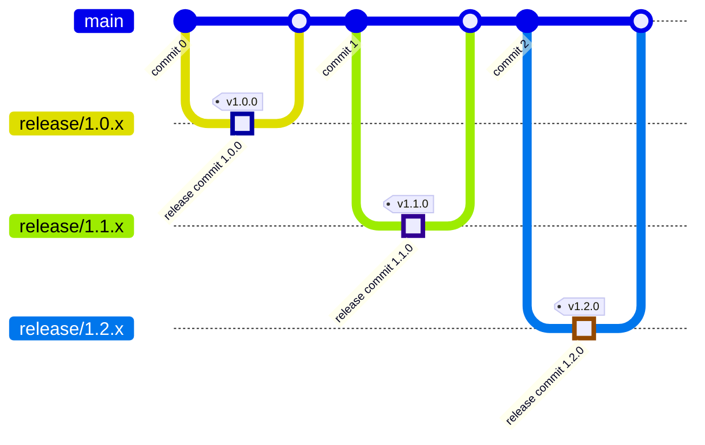
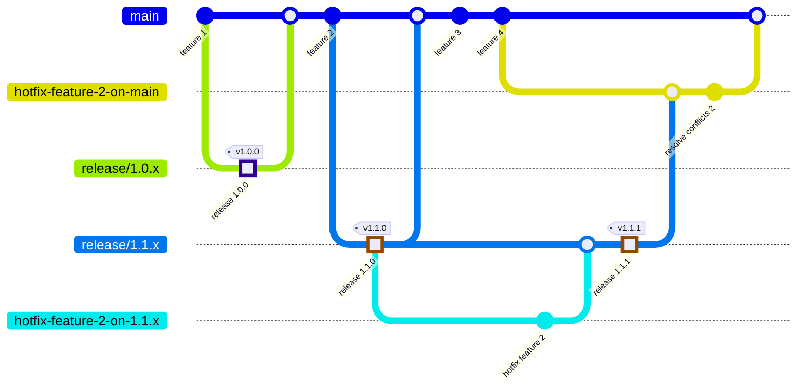
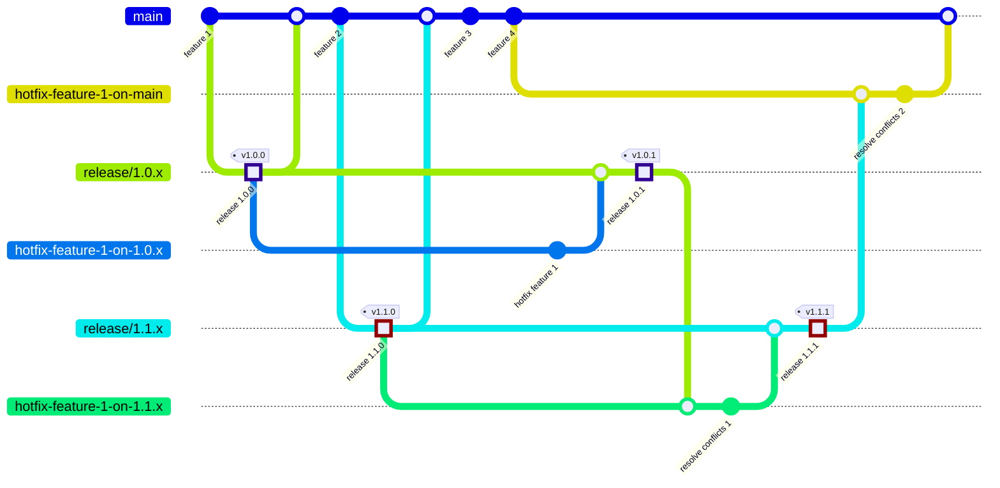

# Release process

## Regular release process

```mermaid
gitGraph
    commit id: "commit 0"
    branch release/1.0.x
    commit id: "release commit 1.0.0" tag: "v1.0.0" type:HIGHLIGHT
    checkout main
    merge release/1.0.x
    
    commit id: "commit 1"
    branch release/1.1.x
    commit id: "release commit 1.1.0" tag: "v1.1.0" type:HIGHLIGHT
    checkout main
    merge release/1.1.x

    commit id: "commit 2"
    branch release/1.2.x
    commit id: "release commit 1.2.0" tag: "v1.2.0" type:HIGHLIGHT
    checkout main
    merge release/1.2.x
```

## Hotfix release process

```mermaid
gitGraph
    commit id: "feature 1"
    branch release/1.0.x order: 1
    commit id: "release 1.0.0" tag: "v1.0.0" type:HIGHLIGHT
    checkout main
    merge release/1.0.x
    
    commit id: "feature 2"
    branch release/1.1.x order: 3
    commit id: "release 1.1.0" tag: "v1.1.0" type:HIGHLIGHT
    checkout main
    merge release/1.1.x

    checkout main
    commit id: "feature 3"
    commit id: "feature 4"

    checkout release/1.1.x
    branch hotfix-feature-2-on-1.1.x order: 3
    commit id: "hotfix feature 2"
    checkout release/1.1.x
    merge hotfix-feature-2-on-1.1.x
    commit id: "release 1.1.1" tag: "v1.1.1" type:HIGHLIGHT

    checkout main
    branch hotfix-feature-2-on-main order: 0
    merge release/1.1.x
    commit id: "resolve conflicts 2"
    checkout main
    merge hotfix-feature-2-on-main
```

## Hotfix release process with backport

```mermaid
gitGraph
    commit id: "feature 1"
    branch release/1.0.x order: 1
    commit id: "release 1.0.0" tag: "v1.0.0" type:HIGHLIGHT
    checkout main
    merge release/1.0.x
    
    commit id: "feature 2"
    branch release/1.1.x order: 3
    commit id: "release 1.1.0" tag: "v1.1.0" type:HIGHLIGHT
    checkout main
    merge release/1.1.x

    checkout main
    commit id: "feature 3"
    commit id: "feature 4"

    checkout release/1.0.x
    branch hotfix-feature-1-on-1.0.x order: 2
    commit id: "hotfix feature 1"
    checkout release/1.0.x
    merge hotfix-feature-1-on-1.0.x
    commit id: "release 1.0.1" tag: "v1.0.1" type:HIGHLIGHT

    checkout release/1.1.x
    branch hotfix-feature-1-on-1.1.x order: 4
    merge release/1.0.x
    commit id: "resolve conflicts 1"
    checkout release/1.1.x
    merge hotfix-feature-1-on-1.1.x
    commit id: "release 1.1.1" tag: "v1.1.1" type:HIGHLIGHT

    checkout main
    branch hotfix-feature-1-on-main order: 0
    merge release/1.1.x
    commit id: "resolve conflicts 2"
    checkout main
    merge hotfix-feature-1-on-main
```
